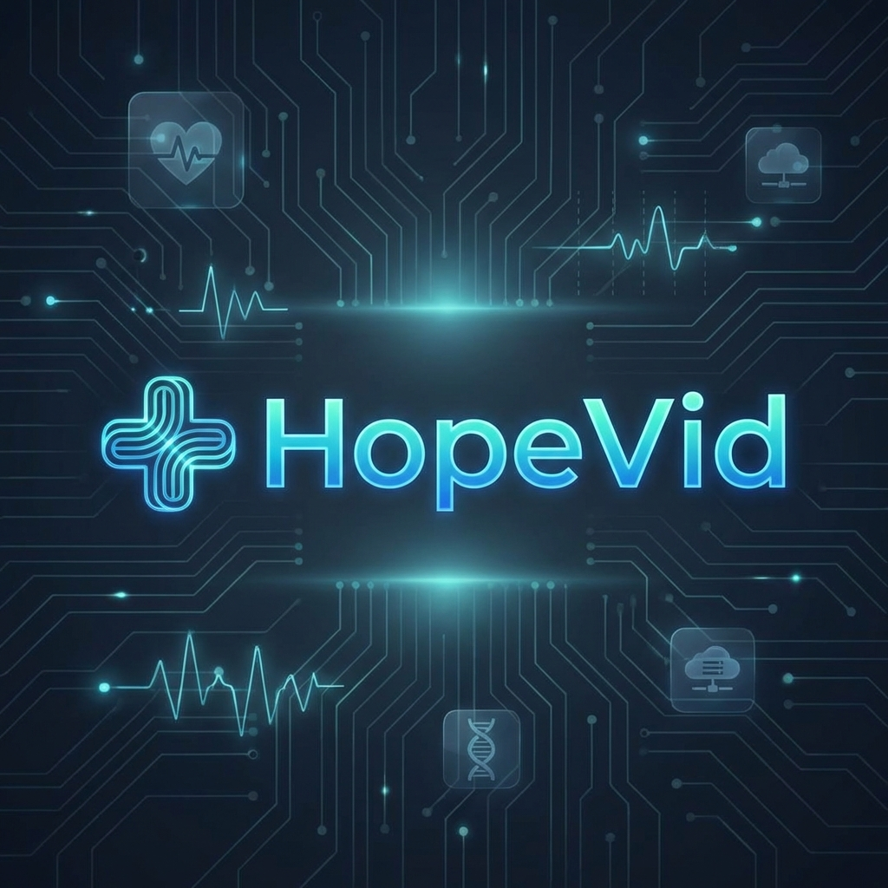

<div align="center">
  
</div>

<h1 align="center">HopeVid</h1>

<p align="center"><b>The full HopeVid build — chatbot, video consultation, and web app — that took 2nd Runners Up at HackRx 1.0.</b></p>

<p align="center">
  
  
  
  
  
</p>

---

## About

- **What** — HopeVid is a preventive, personalized COVID-19 web + mobile platform with two AI chatbots (symptom screening + mental health), in-app video consultation, lab test booking, and community reporting.
- **Who** — Team **codeBlooded**, SRM Institute of Science and Technology, Kattankulathur: Aaishika S Bhattacharya (Team Lead), Souharda Biswas, Akash Ramjyothi, and Gyanesh Samanta.
- **When** — June 2020, during the first COVID-19 wave.
- **Where** — **HackRx 1.0** by Bajaj Finserv Health — finished as **2nd Runners Up**.
- **Why** — Hospital capacity, not the curve, was the binding constraint. HopeVid was built to "raise the line."

> This repository is the **full HopeVid monorepo** — the React chatbot, the Agora video consultation room, and the static web shell that ties them together. (The companion [HackRx1.0](https://github.com/GyaneshSamanta/HackRx1.0) repo holds the original hackathon submission of the static layer alone.)

## The Story

By June 2020 India had crossed 290,000 confirmed cases and entered Stage 3 community transmission. People with mild or ambiguous symptoms had no fast way to know whether to isolate, see a doctor, or book a test — and clinics were either locked down or overwhelmed. Mental health, the silent second pandemic, had no product attention.

Team codeBlooded designed **STAE-C — Systematic Tracking and Escalation Checking**: a chatbot pre-screen for symptoms, automatic referral to a doctor inside an in-app video consultation, lab test booking via partner pathology labs, and conditional escalation to authorities only when results returned positive. A second **mental-health chatbot** ran in parallel doing mood check-ins and suggesting engaging activities. Everything was wrapped in deliberately minimalist UI so users across age groups could navigate it.

The build broke into three modules — a **React + Bulma chatbot SPA** (Create React App, Node 13 / npm 6 era), an **Agora RTC 3.1.1 video room**, and a **multi-page static web shell** with Firebase auth and Firestore — plus a thin React Native WebView wrapper for mobile. End result: **2nd Runners Up** at HackRx 1.0.

## Gallery

<div align="center">
  
  <br/><br/>
  
  <br/><br/>
  
  
</div>

A detailed [API Approach.pdf](chatbot/API%20Approach.pdf) ships inside `chatbot/` for the system / API design.

---

## Tech Stack

- **Frontend (chatbot SPA):** React 16, Create React App, Bulma, Bootstrap, Materialize CSS, axios
- **Frontend (web shell):** HTML5, CSS3, vanilla JS, Bulma
- **Mobile:** React Native (WebView wrapper)
- **Chatbots:** Google DialogFlow — symptom screen + mental-health bot
- **Video Consultation:** Agora RTC SDK 3.1.1
- **Maps:** Mapbox GL
- **Auth / Database:** Firebase, Firestore
- **Cloud:** Microsoft Azure
- **Hosting:** Netlify (initial testing)

## Repo Structure

```
Team-codeBlooded/
├── index.html              # Entry point (web shell)
├── Web-Components/         # Static multi-page web shell
│   ├── Hero.html, About.html, HopeVid.html, News.html
│   ├── Chatbot.html, MHealth.html, Statistics.html, Report.html
│   ├── Login.html, Register.html, Timeline.html, NavBar.html
│   ├── auth.js, loginAuth.js, reportStorage.js
│   ├── styles.css, log.css
│   └── assets/             # Banners, headers, masks
├── Video-Conference/       # Agora RTC video consultation room
│   ├── index.html, AgoraRTCSDK-3.1.1.js, vendor/, assets/
└── chatbot/                # React (CRA) chatbot SPA
    ├── public/, src/, scripts/, config/
    ├── package.json
    └── API Approach.pdf
```

## Getting Started

**Prerequisites:** Node 13.7 / npm 6.13 (per `chatbot/package.json` engines), or Node 16 with `--legacy-peer-deps`.

```bash
git clone https://github.com/GyaneshSamanta/Team-codeBlooded.git
cd Team-codeBlooded

# 1. Static web shell — open directly or serve
npx http-server .                  # then http://localhost:8080

# 2. React chatbot SPA
cd chatbot
npm install                        # add --legacy-peer-deps on modern Node
npm start                          # CRA dev server on :3000
npm run build                      # production build

# 3. Video consultation room
cd ../Video-Conference
# open index.html (set your Agora App ID inside)
```

Add your DialogFlow agent ID, Firebase config, Mapbox token, and Agora App ID to the relevant files before running chatbot, auth, maps, or video features.

## Contributing

Issues and PRs welcome. This is an archived hackathon project — responses may be slow.

## License

Released under the [MIT License](https://lbesson.mit-license.org/).

## Team / Credits

Team **codeBlooded**, SRM IST Kattankulathur:

- [Aaishika S Bhattacharya](https://github.com/aaishikasb) — Team Lead
- [Souharda Biswas](https://github.com/TheSouharda)
- [Akash Ramjyothi](https://github.com/Akash-Ramjyothi)
- [Gyanesh Samanta](https://github.com/GyaneshSamanta)

Special thanks to **Bajaj Finserv Health** for hosting HackRx 1.0.

<div align="center">
  <br/>
  <i>2nd Runners Up — HackRx 1.0 (Bajaj Finserv Health, 2020).</i>
</div>
